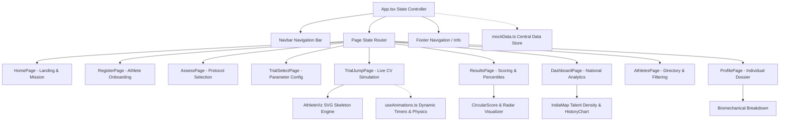

# 🏛️ TalentSpot Architecture & Component Design

This document details the frontend architecture, state management patterns, component hierarchy, and visualization engine of **TalentSpot**.

---

## 1. High-Level Architecture

TalentSpot is built as a high-performance single-page web application using **React 18**, **TypeScript 5.5**, and **Vite 5**, styled with **Tailwind CSS**.



---

## 2. Navigation & Routing State Machine

Rather than relying on browser-level URL navigation, TalentSpot implements an ultra-responsive internal state router inside [`src/App.tsx`](file:///d:/OpenSource/TalentSpot/src/App.tsx).

### Route Definition (`PageName`)
```typescript
type PageName = 
  | 'home'          // Landing & Hero
  | 'register'      // Athlete Registration
  | 'assess'        // Assessment Protocol Hub
  | 'trial-select'  // Test Selection & Camera Pre-check
  | 'trial-jump'    // Live Video & Skeletal Pose Tracking
  | 'results'       // Instant Post-Trial Report Card
  | 'dashboard'     // High-Level Scout & National Analytics
  | 'athletes'      // Searchable Athlete Roster
  | 'profile';      // Deep-Dive Athlete Dossier
```

### Active Flow Transitions
1. **Onboarding Flow**:
   `home` ➔ `register` ➔ `trial-select` ➔ `trial-jump` ➔ `results` ➔ `profile`
2. **Scout Evaluation Flow**:
   `dashboard` ➔ `athletes` ➔ `profile` ➔ `assess` ➔ `trial-select`
3. **Global Header Navigation**:
   The `Navbar` provides continuous one-click access across all top-level operational modes.

---

## 3. Directory Layout

Following the restructuring, the repository adheres to a clean, production-standard structure:

```
TalentSpot/
├── .gitignore               # Vite, Node, and environment ignore rules
├── eslint.config.js         # ESLint TypeScript configuration
├── index.html               # Single-page HTML entry point
├── package.json             # Root dependency & script definitions
├── package-lock.json        # Deterministic lockfile
├── postcss.config.js        # PostCSS Tailwind processor
├── tailwind.config.js       # Custom design tokens, colors & animations
├── tsconfig.json            # Root TypeScript project references
├── tsconfig.app.json        # Application compiler options & path aliases (@/*)
├── tsconfig.node.json       # Node environment compiler options
├── vite.config.ts           # Vite build & bundler configuration
│
├── docs/                    # Technical & architectural documentation
│   ├── ARCHITECTURE.md      # Frontend architecture & component map
│   ├── DATA_MODELS.md       # Data types, schemas & database models
│   └── SYSTEM_SUGGESTIONS.md# AI/CV, offline PWA, and cloud roadmap
│
├── public/                  # Static assets & icons
│
└── src/
    ├── App.tsx              # Root controller & page router
    ├── main.tsx             # React 18 DOM mount point
    ├── index.css            # Tailwind directives & global keyframes
    ├── vite-env.d.ts        # Vite client types
    │
    ├── components/          # Reusable visualization & UI components
    │   ├── AthleteViz.tsx   # Custom SVG human skeletal tracker & pose visualizer
    │   ├── Footer.tsx       # Standard app footer
    │   ├── Navbar.tsx       # Persistent top navigation bar
    │   └── ProgressIndicator.tsx # Multi-step trial progress tracker
    │
    ├── data/
    │   └── mockData.ts      # Structured athlete profiles, trials & benchmarks
    │
    ├── hooks/
    │   └── useAnimations.ts # High-precision requestAnimationFrame animation hooks
    │
    └── pages/               # Top-level screen components
        ├── AssessPage.tsx
        ├── AthletesPage.tsx
        ├── DashboardPage.tsx
        ├── HomePage.tsx
        ├── ProfilePage.tsx
        ├── RegisterPage.tsx
        ├── ResultsPage.tsx
        ├── TrialJumpPage.tsx
        └── TrialSelectPage.tsx
```

---

## 4. Visualization & Biomechanical Engine

TalentSpot avoids heavy external 3D engine overhead by implementing mathematical SVG rendering:

### 1. Dynamic Skeleton Rigging (`AthleteViz.tsx`)
- Renders 14 anthropometric joints (Head, Neck, Shoulders, Elbows, Wrists, Torso, Hips, Knees, Ankles, Feet).
- Calculates real-time joint coordinates based on phase offsets (Pre-jump squat, propulsion, apex flight, cushioned landing).
- Displays dynamic angular vectors (e.g., knee flexion angle, hip hinge) to simulate computer vision skeletal overlays.

### 2. National Talent Density Map (`IndiaMap`)
- Clean SVG path representation of Indian states and geographic zones.
- Highlights talent scout coverage (Punjab, Haryana, Kerala, Maharashtra, Northeast, etc.).
- Interactive state-level popover cards displaying discovered athlete counts and top sports.

### 3. Biometric Radar Chart
- Normalizes an athlete's physical attributes across 6 key axes:
  - **Explosive Power**
  - **Sprint Velocity**
  - **Agility & Reaction**
  - **Endurance**
  - **Flexibility**
  - **Biomechanical Balance**
- Overlays individual athlete polygon over National Average benchmark polygon.

---

## 5. Animation & Physics System (`useAnimations.ts`)

- **Simulation Engine**: Utilizes `requestAnimationFrame` and high-resolution performance timers (`performance.now()`).
- **Phase Transitioning**:
  - `countdown` (3s audio-visual countdown)
  - `preparation` (Squat depth detection)
  - `takeoff` (Peak ground reaction force)
  - `flight` (Vertical displacement calculation)
  - `landing` (Landing stability & valgus analysis)
- **Kinematic Emulation**: Physics calculations map jump flight time $t_{flight}$ to vertical height:
  $$h = \frac{g \cdot t_{flight}^2}{8}$$
