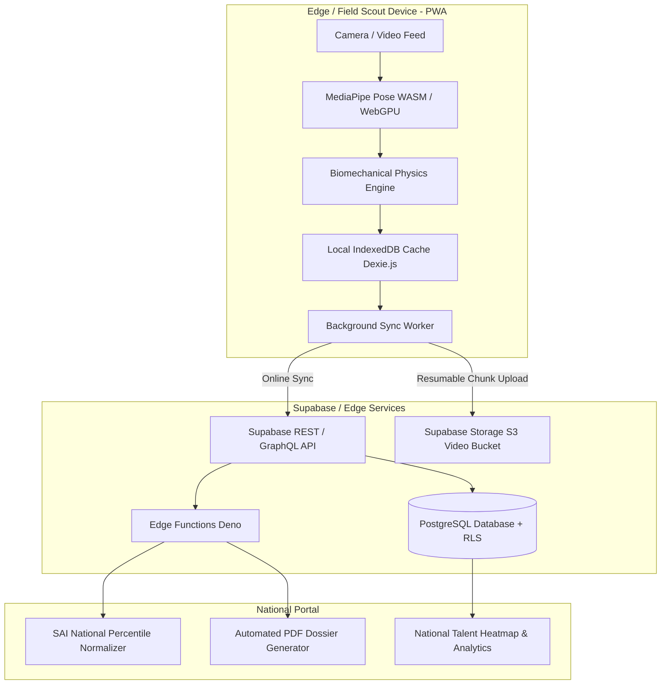

# 🚀 TalentSpot: System Improvement & Architectural Recommendations

> **Important**: This document contains strategic, actionable technical recommendations to advance TalentSpot from its current interactive prototype into a production-grade sports talent identification and scouting ecosystem. Per project guidelines, these are provided **strictly as suggestions and blueprints**.

---

## Executive Architecture Blueprint

---

## 1. Edge Computer Vision & On-Device Biomechanics

Currently, the vertical jump test uses timed mock simulations (`useAnimations.ts`). For true autonomous talent identification, compute should run **client-side on the scout's device** without requiring cloud GPU processing.

### A. MediaPipe Pose over WebAssembly / WebGPU
- **Model Choice**: Integrate `@mediapipe/pose` or `@tensorflow-models/pose-detection` (BlazePose Full / Heavy).
- **Topology**: 33 3D skeletal landmarks sampled at 30–60 FPS.
- **Why On-Device?** Zero cloud GPU server costs, instantaneous feedback to the athlete, and functionality even when completely offline.

### B. Vertical Jump Kinematics & Calculation
Instead of arbitrary estimates, vertical jump height should be calculated using two complementary biomechanical methods:
1. **Flight Time Kinematics (Recommended for standard cameras)**:
   Detect exact frame of takeoff (both feet leave ground) and landing (initial ground contact):
   $$h = \frac{g \cdot t_{\text{flight}}^2}{8} \quad \text{where } g = 9.80665\,\text{m/s}^2$$
   - *Example*: An athlete in flight for $0.58\text{ s}$ yields:
     $$h = \frac{9.80665 \times (0.58)^2}{8} = 0.412\,\text{m} = 41.2\,\text{cm}$$
2. **Hip Landmark Relative Displacement**:
   Using the mid-hip point (average of landmark 23 `left_hip` and landmark 24 `right_hip`):
   $$\Delta y = y_{\text{apex}} - y_{\text{standing}}$$
   Normalized against standing ankle-to-hip pixel height to cancel camera distance variations.

### C. Camera Calibration & Tripod Alignment Assistant
- Add an on-screen visual bounding box overlay with an embedded gyroscope check (`window.DeviceOrientationEvent`).
- Ensure the phone/tablet is held vertically ($90^\circ \pm 3^\circ$) and at hip level, with an on-screen badge turning green only when the athlete's full body (head to feet) is in frame.

### D. Automated Sprint Timing (Optical Tripwire Gate)
- For the 30m sprint test, use the phone camera as a finish-line tripwire.
- Detect the athlete breaking the vertical pixel boundary line using frame differencing or bounding box overlap, capturing sprint finish times to $\pm 0.03\text{ s}$ precision.

---

## 2. Offline-First Architecture for Rural Scouting Grounds

Talent scouting in rural India (talukas, village grounds, school fields) frequently suffers from low or non-existent 4G/5G mobile connectivity.

### A. Progressive Web App (PWA) with Service Worker
- Add `vite-plugin-pwa` to register a robust Workbox service worker.
- Cache all UI assets, HTML, JavaScript bundles, Tailwind styles, and MediaPipe model binaries (`.tflite` / `.wasm`) locally.

### B. Local Persistence with IndexedDB (Dexie.js)
- When a scout registers an athlete and records trials in the field:
  1. Save athlete bio and trial metrics to IndexedDB immediately.
  2. Record 5-second compressed trial video clips locally in WebM (`MediaRecorder` API with VP8/VP9 hardware encoding).
  3. Mark state as `sync_status: 'pending'`.

### C. Background Sync API
- Register a `sync` event (`navigator.serviceWorker.ready.then(sw => sw.sync.register('sync-trials'))`).
- When the scout returns to an area with WiFi or 4G connectivity, the browser automatically flushes pending athlete records to the Supabase backend.

---

## 3. Backend, Database & Storage Architecture (Supabase)

TalentSpot already lists `@supabase/supabase-js` in `package.json`. Transitioning from `src/data/mockData.ts` to active cloud persistence is straightforward.

### A. Authentication & Role-Based Access Control (RBAC)
Implement distinct user roles via Supabase Auth:
- `scout`: Can register athletes, record trials, and view their assigned district/state.
- `coach / academy`: Can search verified talent, shortlist athletes, and request trial verifications.
- `sai_admin` (Sports Authority of India): High-level access to national dashboard, analytics, and talent allocation.
- `athlete / parent`: Read-only view of their personal scorecard and QR badge.

### B. Resumable Video Storage with Chunked Uploads
- Large trial video files recorded in rural areas can fail if uploaded in a single HTTP POST.
- Integrate `tus-js-client` with Supabase Storage:
  - Supports pause/resume on flaky networks.
  - Automatically retries dropped connections without restarting from byte 0.

### C. Supabase Edge Functions (Deno / TypeScript)
- Deploy serverless Edge Functions for:
  - **Dossier PDF Generation**: Generate official Khelo India / SAI formatted PDF report cards.
  - **Anomaly Detection**: Flag suspicious trials (e.g., jump height $> 75\text{ cm}$ or impossible sprint speeds) for manual video review.

---

## 4. National Sports Benchmarking & Talent Pipeline

### A. Sports Authority of India (SAI) Age-Graded Percentiles
- Instead of static scoring, evaluate performance by demographic cohorts:
  - Age brackets: U-12, U-14, U-16, U-18, U-21.
  - Gender-specific normal distribution curves ($\mu, \sigma$).
- A 40 cm jump for a 14-year-old girl represents the 98th percentile, whereas for an 18-year-old male it represents the 70th percentile. Dynamic cohort curves ensure fair talent discovery.

### B. Biomechanical Injury Prevention (Knee Valgus Detection)
- Many young athletes suffer ACL injuries due to inward knee collapse (dynamic valgus) upon landing.
- Analyze the angle formed between Hip $\rightarrow$ Knee $\rightarrow$ Ankle at maximum landing compression:
  - An angle $< 165^\circ$ indicates inward knee collapse.
  - Highlight this in the scout report as a "Corrective Conditioning Needed" flag to prevent future injuries.

### C. Scout Shortlisting & Watchlist
- Add a "Shortlist" button on athlete profile cards.
- Allow scouts and academies to export a structured Excel / CSV sheet or PDF dossier of top-rated prospects for national camps.

---

## 5. Frontend & UX Upgrades

### A. Declarative URL Routing
- Migrate from `App.tsx`'s internal `PageName` state variable to **TanStack Router** or **React Router v6**.
- Benefits:
  - Shareable URLs (e.g., `talentspot.in/athletes/TS-1024`).
  - Browser back/forward button navigation works naturally.
  - Deep-linking directly to a specific assessment protocol (`/assess/jump`).

### B. Multilingual Localization (i18n)
- Many grassroots coaches and scouts in rural India are most comfortable in regional languages.
- Introduce `react-i18next` with language toggles for:
  - **Hindi (हिन्दी)**
  - **Assamese (অসমীয়া)**
  - **Bengali (বাংলা)**
  - **Punjabi (ਪੰਜਾਬੀ)**
  - **Marathi (मराठी)**
  - **Tamil (தமிழ்)**
  - **Telugu (తెలుగు)**

### C. Single Unified Types Directory (`src/types/`)
- Extract TypeScript interfaces from `src/data/mockData.ts` into clean, modular files:
  - `src/types/athlete.ts`
  - `src/types/assessment.ts`
  - `src/types/database.ts`
- This ensures clean separation between mock data fixtures and type definitions.

---

## Summary Matrix

| Suggestion Area | Primary Benefit | Implementation Effort | Recommended Tech |
| :--- | :--- | :--- | :--- |
| **MediaPipe Pose CV** | Real autonomous jump & sprint measurement | Medium (2–3 weeks) | `@mediapipe/pose`, WebGPU |
| **Offline-First PWA** | Works in remote rural Indian grounds | Low-Medium (1 week) | `vite-plugin-pwa`, `dexie` |
| **Supabase Cloud DB** | Real athlete persistence & scout logins | Low-Medium (1–2 weeks) | `@supabase/supabase-js`, RLS |
| **SAI Percentiles** | Fair, age-graded talent discovery | Low (3–4 days) | Statistical Z-score functions |
| **Regional Languages** | Grassroots adoption across rural states | Low-Medium (1 week) | `i18next`, `react-i18next` |
| **Declarative URLs** | Direct bookmarking & shareable profiles | Low (2–3 days) | `react-router-dom` or TanStack |
