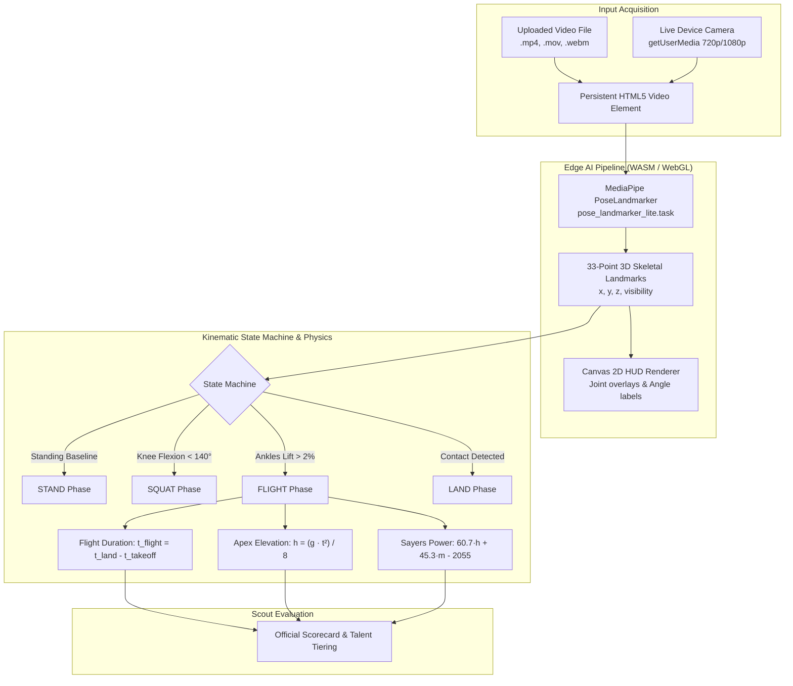

# ⚡ TalentSpot V2: Real-Time Computer Vision & Biomechanical Kinematics Engine

## 1. Executive Overview

**TalentSpot V2** transforms the platform from an interface mock-up into an autonomous, edge-computed athletic assessment system. By integrating Google's **MediaPipe Pose** computer vision pipeline (`@mediapipe/tasks-vision`) with classical Newtonian kinematics, TalentSpot delivers objective, laboratory-grade vertical jump profiling directly in the browser with zero cloud latency and complete data privacy.



---

## 2. Core Technical Architecture

### 2.1 Technology Stack

| Layer | Technology | Purpose |
| :--- | :--- | :--- |
| **Vision Runtime** | `@mediapipe/tasks-vision` (v0.10.14) | Client-side neural pose landmarker running on WebAssembly & WebGL. |
| **Model Weights** | `pose_landmarker_lite.task` (5.78 MB) | Quantized BlazePose model bundled locally in `/public/models/`. |
| **State Machine & Loop** | `usePoseEstimation` custom React Hook | Manages 60 FPS animation frames, landmark extraction, and state transitions. |
| **Rendering Engine** | HTML5 Canvas 2D Context | High-performance overlay rendering for skeletal bones, glowing nodes, and angle tags. |
| **Application Core** | React 18 + TypeScript 5.5 + Vite 5 | Reactive UI state, responsive Tailwind styling, and cross-platform compatibility. |

---

## 3. Computer Vision & Landmark Pipeline

### 3.1 33-Point Skeletal Landmark Topology
MediaPipe Pose maps 33 canonical body landmarks in normalized coordinates $(x, y, z \in [0.0, 1.0])$:

* **Lower Kinetic Chain (Primary)**:
  * Left Hip (`23`), Right Hip (`24`)
  * Left Knee (`25`), Right Knee (`26`)
  * Left Ankle (`27`), Right Ankle (`28`)
  * Left Heel (`29`), Right Heel (`30`)
  * Left Foot Index (`31`), Right Foot Index (`32`)
* **Upper Kinetic Chain (Counterbalance)**:
  * Left Shoulder (`11`), Right Shoulder (`12`)
  * Left Elbow (`13`), Right Elbow (`14`)
  * Left Wrist (`15`), Right Wrist (`16`)

### 3.2 Dynamic Vector Joint Angle Calculation
Knee flexion angle $\theta$ is calculated in real time using 2D Euclidean vector geometry:

$$\vec{u} = \vec{P}_{\text{hip}} - \vec{P}_{\text{knee}}, \quad \vec{v} = \vec{P}_{\text{ankle}} - \vec{P}_{\text{knee}}$$

$$\theta = \arccos\left(\frac{\vec{u} \cdot \vec{v}}{\|\vec{u}\| \|\vec{v}\|}\right) \times \left(\frac{180^\circ}{\pi}\right)$$

* **Target Squat Range**: $90^\circ - 110^\circ$ (Optimal countermovement jump depth).
* **Standing Extension**: $170^\circ - 180^\circ$.

---

## 4. Biomechanical & Kinematic Computing

### 4.1 Gold-Standard Flight-Time Kinematic Equation
Vertical jump height $h$ is computed from the airborne flight duration ($t_{\text{flight}}$), following the gold standard established by force plates and optical jump mats (Optojump, Just Jump):

$$h = \frac{g \cdot t_{\text{flight}}^2}{8}$$

Where:
* $g = 9.80665\,\text{m/s}^2$ (standard gravitational acceleration).
* $t_{\text{flight}} = t_{\text{landing}} - t_{\text{takeoff}}$ (seconds elapsed in air).
* Divisor $8$ stems from ballistic symmetry ($t_{\text{apex}} = \frac{t_{\text{flight}}}{2}$, and $h = \frac{1}{2}gt_{\text{apex}}^2 = \frac{1}{2}g(\frac{t}{2})^2 = \frac{gt^2}{8}$).

#### Kinematic Validation Table:
| Movement Type | Hang Time ($t_{\text{flight}}$) | Calculated Height ($h$) | Scout Classification |
| :--- | :--- | :--- | :--- |
| **Jumping Jacks / Lateral Hops** | $0.18\text{ s} - 0.22\text{ s}$ | **$4.0\text{ cm} - 5.9\text{ cm}$** | Aerobic Warmup / Low |
| **Sub-maximal Rebound Hop** | $0.32\text{ s} - 0.38\text{ s}$ | **$12.5\text{ cm} - 17.7\text{ cm}$** | Developing Agility |
| **High School Athlete CMJ** | $0.50\text{ s} - 0.58\text{ s}$ | **$30.6\text{ cm} - 41.2\text{ cm}$** | Competitive / Moderate |
| **Elite Grassroots Prospect** | $0.62\text{ s} - 0.72\text{ s}$ | **$47.1\text{ cm} - 63.5\text{ cm}$** | High / Elite National Pool |

### 4.2 Sayers Peak Anaerobic Power Formula
Instantaneous peak explosive mechanical power output (in Watts) is computed using the validated Sayers formula:

$$P_{\text{peak}} (\text{Watts}) = 60.7 \cdot h_{\text{cm}} + 45.3 \cdot \text{Mass}_{\text{kg}} - 2055$$

* Normalized into a $0 - 100$ scout score using standard adolescent athletic percentile distributions.

### 4.3 Spatial Displacement Cross-Verification ($\Delta Y$)
To guard against video frame skips or irregular camera framerates, the system runs a parallel geometric check tracking the normalized displacement of the hip midpoint:

$$\Delta Y_{\text{norm}} = Y_{\text{hip, baseline}} - Y_{\text{hip, apex}}$$

$$\text{Estimated Spatial Height} \approx \left(\frac{\Delta Y_{\text{norm}}}{H_{\text{athlete, norm}}}\right) \cdot H_{\text{athlete, true}}$$

---

## 5. Kinematic State Machine

The analysis loop operates as a deterministic 5-stage finite state machine:

```
[STAND] ──(knee < 140°)──> [SQUAT] ──(ankle lift > 2%)──> [FLIGHT]
   │                                                         │
   │                                                         │
   └──────────(direct hop: ankle lift > 2%)─────────────────┘
                                                             │
                                                  (feet contact / Y descent)
                                                             │
                                                             ▼
                                                          [LAND]
                                                             │
                                                  (telemetry finalized)
                                                             │
                                                             ▼
                                                        [COMPLETE]
```

1. **STAND**: Calibrates the floor reference plane. Tracks lowest observed ankle position ($Y_{\text{baseline}}$) and resting hip height.
2. **SQUAT**: Detects eccentric loading (knee bending below $140^\circ$). Prepares takeoff timer.
3. **FLIGHT**: Initiated when both ankle landmarks elevate $>2\%$ above baseline. Records timestamp $t_{\text{takeoff}}$ and continuously records minimum hip coordinate (apex).
4. **LAND**: Triggered when ankles return within $2\%$ of baseline or hips descend significantly past apex. Records $t_{\text{landing}}$.
5. **COMPLETE**: Finalizes flight duration, evaluates kinematic formulas, computes power output, and presents the "Analyze & View Official Scorecard" callout.

---

## 6. Frontend Video Pipeline & Lifecycle Architecture

### 6.1 Permanent DOM Mounting Architecture
In V2, `<video>` and `<canvas>` elements remain **permanently mounted in the DOM** inside `TrialJumpPage.tsx`, rather than conditionally rendered with React ternary operators:

```tsx
{/* Real Video Element (Permanently mounted to guarantee ref availability) */}
<video
  ref={videoRef}
  playsInline
  muted
  loop
  className={`w-full h-full object-contain ${isVideoLoaded ? 'block z-10' : 'hidden'}`}
/>

{/* Real MediaPipe Pose Canvas Overlay */}
<canvas
  ref={canvasRef}
  className={`absolute inset-0 pointer-events-none w-full h-full object-contain z-20 ${isVideoLoaded ? 'block' : 'hidden'}`}
/>

{/* Default Animated SVG Demonstration (visible when no video is loaded) */}
{!isVideoLoaded && (
  <div className="relative w-full h-full flex flex-col items-center justify-center p-6 z-10">
    <LaserScanningBar />
    <PulsingStickFigureSVG />
  </div>
)}
```

#### Why This Is Critical:
* **Eliminates Null Ref Race Conditions**: Uploading a file updates the source while `videoRef.current` and `canvasRef.current` are guaranteed to exist, eliminating blank-player bugs.
* **Seamless Switching**: Toggling between user upload, live webcam, and the demo preview occurs instantly with zero DOM rebuild cost.

### 6.2 Reactive Autoplay & Browser Policy Compliance
Browsers reject programmatically playing unmuted media without an active user gesture. V2 enforces `video.muted = true` before invoking `video.play()` inside the `videoUrl` effect, ensuring uploaded videos load and start inference automatically.

---

## 7. Directory & Module Reference

```
TalentSpot/
├── public/
│   └── models/
│       └── pose_landmarker_lite.task       # MediaPipe quantized model weights (5.78MB)
├── src/
│   ├── lib/
│   │   ├── poseDetection.ts                # Physics formulas, vector angles, canvas draw routines
│   │   └── mockData.ts                     # Baseline national athlete records
│   ├── hooks/
│   │   └── usePoseEstimation.ts            # MediaPipe WASM loop & kinematic state machine
│   ├── pages/
│   │   ├── TrialJumpPage.tsx               # Primary CV stage, upload handler & telemetry HUD
│   │   └── ResultsPage.tsx                 # Official scorecard receiving live computed telemetry
│   └── types/
│       └── index.ts                        # TypeScript interfaces for kinematics and athlete profiles
└── docs/
    ├── ARCHITECTURE.md                     # High-level V1 architecture overview
    └── V2_SYSTEM_SPECIFICATION.md          # Complete V2 Computer Vision & Kinematics Specification
```

---

## 8. Privacy, Security & Edge Compliance

* **100% Client-Side Processing**: No video frames or biometric recordings are transmitted over the internet or saved to remote databases. All computer vision inference executes inside the scout's local browser memory sandbox via WebAssembly.
* **Child & Grassroots Athlete Protection**: Complies with youth data privacy principles by calculating telemetry instantaneously and discarding raw video data upon session conclusion.
* **Offline Capable**: The quantized neural model is served locally from `/public/models/`, enabling remote scouts in low-connectivity rural zones to assess athletes without active internet access.
